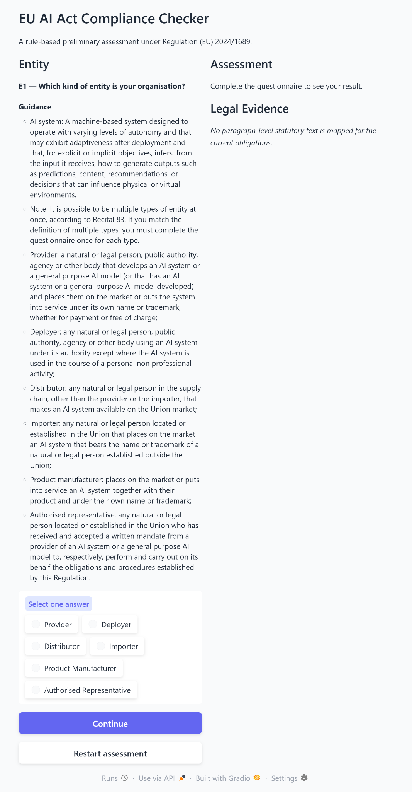
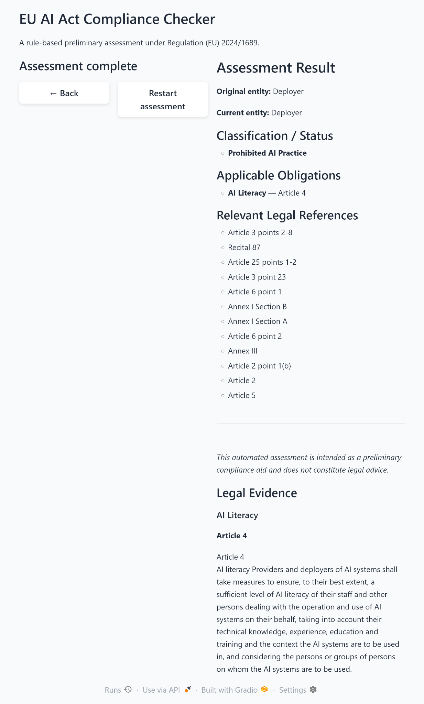

# EU AI Act Compliance Checker

A rule-based preliminary compliance assessment tool for Regulation (EU) 2024/1689 (the EU AI Act), built with Python and Gradio.

The application guides users through a structured questionnaire, applies deterministic legal rules, identifies relevant classifications and obligations, and links assessment results to provisions of the EU AI Act.

> **Disclaimer:** This project is intended as a preliminary compliance aid and does not constitute legal advice.

## Overview

The EU AI Act assigns different requirements depending on factors such as the role of the operator, territorial scope, the type and intended use of the AI system, high-risk classification, prohibited practices, and specific transparency requirements.

This project translates selected parts of that regulatory structure into a deterministic questionnaire and rule engine.

Rather than asking a large language model to make a legal classification, the application follows explicitly encoded decision rules. This makes the assessment path reproducible and allows the resulting classifications and obligations to be traced to relevant provisions of Regulation (EU) 2024/1689.

The project also extracts statutory text from the Regulation to provide legal evidence for selected obligations.

## Features

- Entity classification, including providers, deployers, distributors, importers, product manufacturers, and authorised representatives
- Entity-status changes where the Regulation treats another operator as a provider
- Territorial-scope assessment
- High-risk AI classification
- Annex I and Annex III assessment paths
- Article 6(3) high-risk exceptions
- Prohibited-practice screening
- General-purpose AI and systemic-risk assessment paths
- Transparency-obligation assessment
- Fundamental-rights impact assessment screening
- Deterministic rule-based legal reasoning
- Relevant legal references for questionnaire decisions
- Article- and paragraph-level statutory evidence for mapped obligations
- Back navigation with questionnaire-state restoration
- Assessment restart functionality
- Automated tests for compliance logic, legal-text extraction, and application navigation

## Application

### Questionnaire

The application presents questions dynamically according to the preceding answers and the current operator status.



### Example Assessment Result

The final assessment presents the resulting entity status, classification, applicable obligations, relevant legal references, and available statutory evidence.



## How It Works

The application uses a deterministic assessment pipeline:

```text
Questionnaire
    |
    v
Rule engine
    |
    v
Entity and status classification
    |
    v
Applicable obligations
    |
    v
Relevant legal references
    |
    v
Statutory evidence
```

Questionnaire rules are stored as structured data and processed by the compliance engine. Each answer can determine the next question and may update the current entity, classification, obligations, or legal references.

The application therefore separates:

1. **Questionnaire presentation** - the Gradio user interface
2. **Compliance logic** - deterministic rule processing and state transitions
3. **Legal sources** - extraction of relevant provisions from the Regulation
4. **Testing** - regression tests for legal logic, extraction, and navigation

This architecture avoids relying on probabilistic LLM output for the legal classification itself.

## Legal Coverage

The current rule set incorporates selected provisions and concepts from Regulation (EU) 2024/1689, including:

- **Article 2** - scope of the Regulation
- **Article 3** - definitions, including AI systems and operator roles
- **Article 4** - AI literacy
- **Article 5** - prohibited AI practices
- **Article 6** - classification rules for high-risk AI systems
- **Article 25** - responsibilities along the AI value chain and circumstances in which other operators may assume provider responsibilities
- **Article 27** - fundamental-rights impact assessments for specified high-risk AI systems
- **Article 50** - transparency obligations
- **Article 51** - classification of general-purpose AI models with systemic risk
- **Annex I** - Union harmonisation legislation relevant to high-risk classification
- **Annex III** - specified high-risk AI-system use cases

Selected obligations are connected to statutory evidence extracted directly from the Regulation. Current mappings include, among others:

- AI Literacy -> Article 4
- Documentation of a non-high-risk assessment -> Article 6(4)
- Registration associated with Article 6(4)
- Fundamental Rights Impact Assessment -> Article 27(1)
- Selected transparency obligations -> Article 50

The questionnaire does not attempt to encode every provision, exception, delegated act, guideline, or sector-specific requirement that may be relevant to an actual AI system.

## Project Structure

```text
eu-ai-act-compliance-checker/
|
|-- app.py
|-- add_explanations.ps1
|-- Dockerfile
|-- .dockerignore
|-- requirements.txt
|-- README.md
|-- LICENSE.txt
|
|-- data/
|   |-- raw/
|   `-- processed/
|       `-- compliance_rules.json
|
|-- images/
|   |-- assessment-start.png
|   `-- assessment-result.png
|
|-- src/
|   |-- compliance_engine.py
|   `-- legal_text.py
|
`-- tests/
    |-- test_app.py
    |-- test_compliance_engine.py
    `-- test_legal_text.py
```

### Main Components

**`app.py`**

Provides the Gradio interface, questionnaire rendering, navigation, assessment-result presentation, and legal-evidence display.

**`src/compliance_engine.py`**

Implements the deterministic compliance logic, including questionnaire routing, state updates, entity changes, classifications, obligations, and legal references.

**`src/legal_text.py`**

Extracts relevant Articles and paragraphs from the EU AI Act source PDF and maps selected obligations to precise statutory provisions.

**`data/processed/compliance_rules.json`**

Contains the structured questionnaire, answer options, routing rules, guidance, legal bases, classifications, and obligations used by the assessment engine.

**`tests/`**

Contains automated tests covering the rule engine, statutory-text extraction, evidence mapping, and application navigation.

## Testing

The project currently contains **42 automated tests**.

The test suite covers areas including:

- questionnaire routing
- entity transformations
- order-independent rule precedence
- high-risk classification
- Article 6(3) exceptions
- prohibited-practice termination
- general-purpose AI paths
- transparency obligations
- legal-reference handling
- Article and paragraph extraction
- statutory-evidence mappings
- PDF extraction cleanup
- questionnaire history
- Back navigation
- Restart behavior

Run the complete test suite with:

```powershell
python -m pytest -v
```

## Installation

### 1. Clone the repository

```powershell
git clone https://github.com/gokifujiya/eu-ai-act-compliance-checker.git
cd eu-ai-act-compliance-checker
```

### 2. Create and activate a virtual environment

Using `uv`:

```powershell
uv venv
.venv\Scripts\Activate.ps1
```

### 3. Install the required dependencies

Install the Python packages required by the project, including Gradio, pypdf, and pytest.

If a dependency file is added to the repository, install from that file instead.

## Usage

Start the application with:

```powershell
python app.py
```

Gradio will start a local server, normally available at:

```text
http://127.0.0.1:7860
```

Open the local address in a browser and complete the questionnaire.

The final assessment may display:

- original and current entity status
- classification or status changes
- applicable obligations
- relevant legal references
- mapped statutory evidence

## Docker

The application can also be run in a Docker container.

### Build the image

From the project root:

```bash
docker build -t eu-ai-act-compliance-checker .
```

### Run the container

```bash
docker run --rm -p 7860:7860 eu-ai-act-compliance-checker
```

Then open:

```text
http://localhost:7860
```

The Gradio application will be available on port `7860`.

### Stop the application

Press `Ctrl+C` in the terminal running the container. Because the container is started with `--rm`, it is automatically removed after it stops.

## Design Principles

### Deterministic legal reasoning

The legal classification is performed through explicit rules rather than generated by an LLM. The same inputs therefore produce the same assessment path.

### Traceability

Questionnaire branches contain legal references so that important decisions can be traced to provisions of the Regulation.

### Separation of logic and presentation

Compliance rules, legal-text extraction, and the Gradio interface are implemented separately, making the project easier to test and extend.

### Regression testing

Automated tests protect important assessment paths and previously identified edge cases, including entity transitions, rule precedence, navigation, and legal-text extraction boundaries.

## Limitations

This project is a **preliminary rule-based compliance aid**, not a complete implementation of the EU AI Act.

In particular:

- it covers selected provisions and assessment paths rather than every obligation in Regulation (EU) 2024/1689;
- not every legal reference currently has paragraph-level statutory evidence mapped in the interface;
- an assessment result stating that no specific obligation was identified on a particular path does not mean that the relevant organisation has no obligations under the EU AI Act or other applicable law;
- sector-specific legislation may impose additional requirements;
- the legal consequences of an AI system depend on its actual design, intended purpose, deployment context, operator roles, and other facts;
- future amendments, delegated acts, implementing acts, Commission guidance, standards, and case law may affect the analysis.

The application should therefore not be used as a substitute for professional legal advice or a complete compliance assessment.

## Technologies

- Python
- Gradio
- pytest
- pypdf
- JSON-based rule definitions
- Git / GitHub

## Legal Source

The principal legal source used by the project is:

**Regulation (EU) 2024/1689 of the European Parliament and of the Council laying down harmonised rules on artificial intelligence (Artificial Intelligence Act).**

The Regulation itself and other third-party legal materials are not licensed under this project's MIT License.

## License

The software in this repository is licensed under the MIT License. See [LICENSE.txt](LICENSE.txt) for details.
